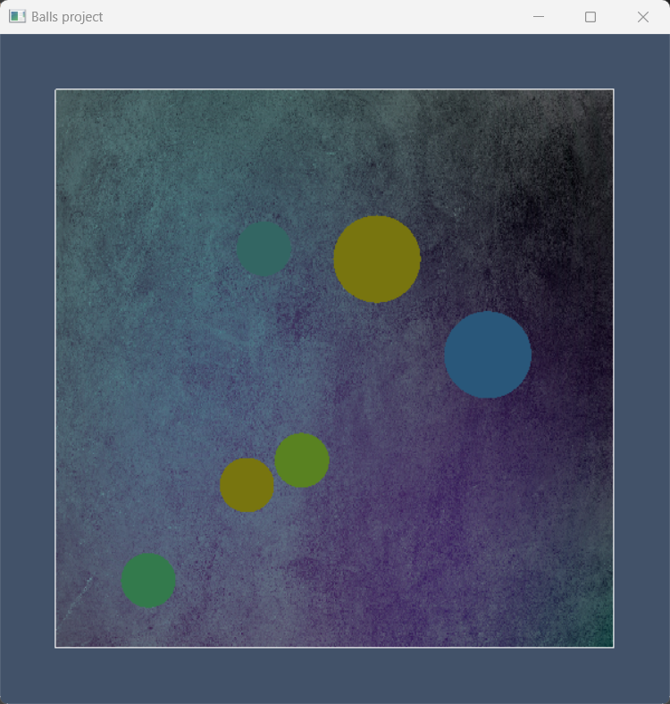
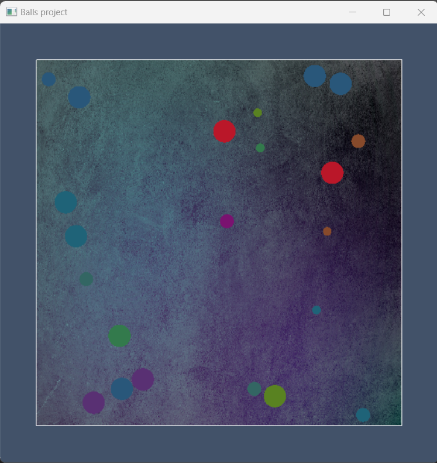
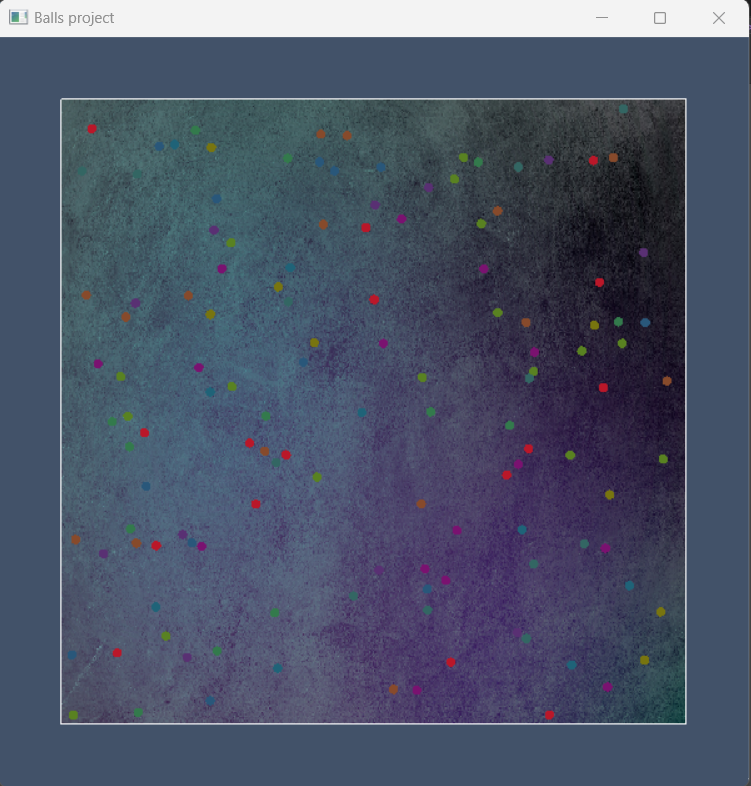

# Balls project

## Conceptul proiectului
Pentru acest proiect am ales să creăm o animație 2D care implică bile în mișcare, cu ajutorul OpenGL. Am ales această idee pentru că este dinamică și plăcută vizual. Inițial animația începe cu o singură bilă ce se mișcă aleator în chenarul desenat, iar la numărul de coliziuni setat, aceasta se divide în două bile mai mici, acest procedeu repetându-se pentru fiecare bilă până se atinge raza minimă, setată la început. Am urmărit obținerea unei simulări interactive a mișcării și coliziunilor, evidențiind conceptele de fizică, matematică și grafică.

## Transformări incluse

În cadrul proiectului am folosit o compunere de translație și scalare pentru a diviza bilele și a realiza mișcarea acestora cu o anumită viteză. 

Bilele se mișcă într-un spațiu 2D și se ciocnesc unele cu altele și cu marginile ferestrei, respectând legile conservării impulsului și a energiei cinetice. La coliziuni, vitezele bilelor sunt calculate în funcție de masele lor pentru a asigura o coliziune elastică. Dacă o bilă a suferit un număr specific de coliziuni, se poate diviza în două bile mai mici, fiecare cu o nouă direcție de mișcare. 

Utilizatorul poate configura inițial viteza și dimensiunea bilelor, precum și numărul maxim de coliziuni înainte de divizare. De asemenea, animația rulează cu o limitare a rate-ului de cadre (60 cadre pe secundă) pentru o experiență uniformă pe diferite sisteme.

## Originalitate
Proiectul este original prin modul în care combină concepte de fizică și matematică pentru a crea o simulare interactivă și captivantă a mișcării bilelor. Printre aspectele originale utilizate în proiect se numără interacțiunea realistă a bilelor, rate-ul de cadre stabilizat, divizarea bilelor și configurabilitatea inițială.

## Capturi de ecran relevante

<video src="Balls_project_video.mp4" controls title="Title"></video>
